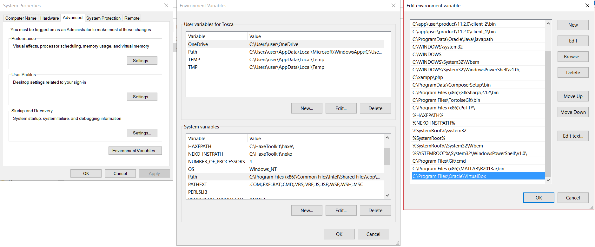
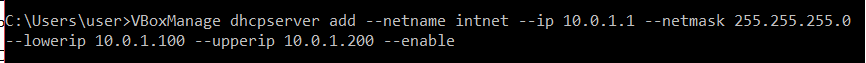
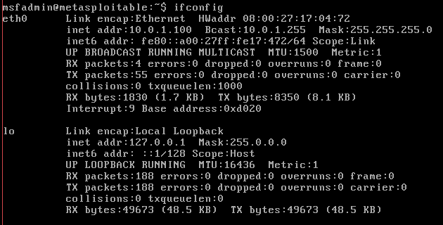
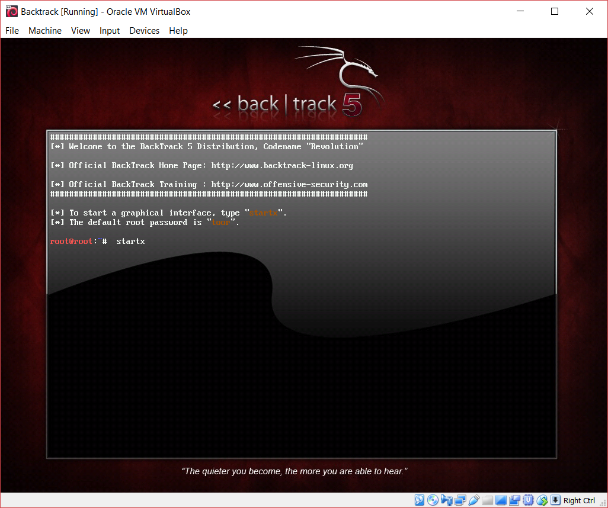
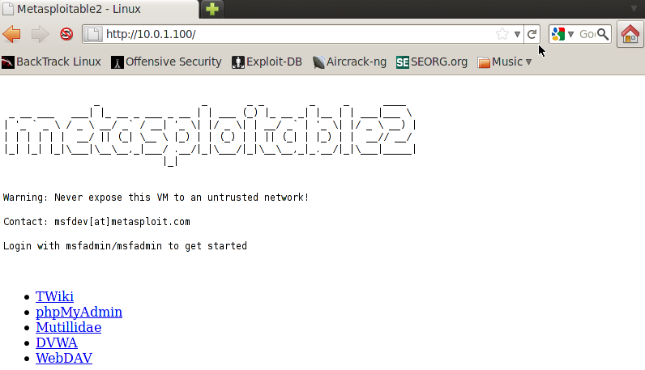
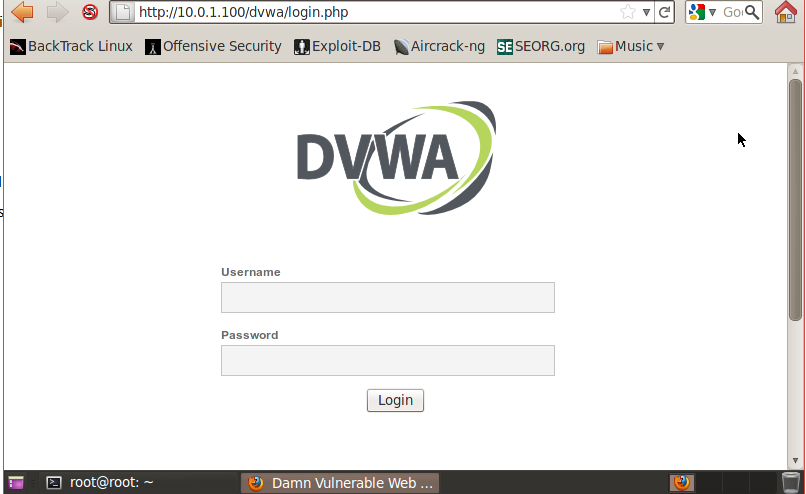

# Konfigurasi

1. Jika kita mengakses menggunakan Windows, kita perlu mengonfigurasi environment path dari windows tersebut. Hal ini akan mengizinkan kita untuk menambahkan jaringan internal pada virtual box yang akan digunakan.


2. Tambahkan sebuah jaringan internal dengan cara mengetikkan perintah berikut di cmd komputer host.
```shell
VBoxManage dhcpserver add --netname intnet ip 10.0.1.1 --netmask 255.255.255.0 --lowerip 10.0.1.100 --upperip 10.0.1.200 --enable
```


3. Jalankan virtual box.


4. Edit pengaturan jaringan metasploit menjadi internal network dan pilih intnet.

5. Jalankan metasploit, masukkan username dan password : msfadmin/msfadmin.


6. Periksa apakah ip dari metasploit telah diatur dengan menggunakan perintah berikut.
```bash
ifconfig
```


7. Setelah login, jalankan perintah ```startx``` agar bisa mengakses UI.



8. Edit pengaturan jaringan backtrack menjadi internal network dan pilih intnet.

9. Tambah sebuah adapter bridge network ke backtrack agar bisa mengakses internet keluar.

10. Jika semua konfigurasi sudah benar, maka harusnya backtrack bisa mengakses server metasploit menggunakan ip ataupun hanya sekedar melakukan ping. Di backtrack, buk browser dan masukkan ip dari metasploit.


11. Akses halaman DVWA yang ada di home dari server metasploit tersebut. Input username dan password : admin/password.


12. Pilih low dari menu dropdown dan klik submit untuk mengatur tingkat sekuritas dari dvwa yang akan dites.