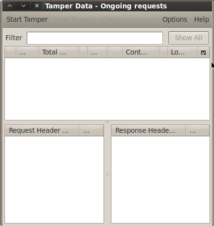
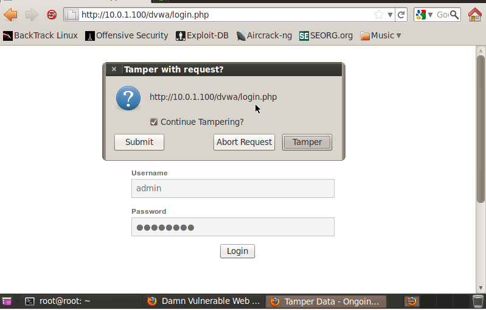
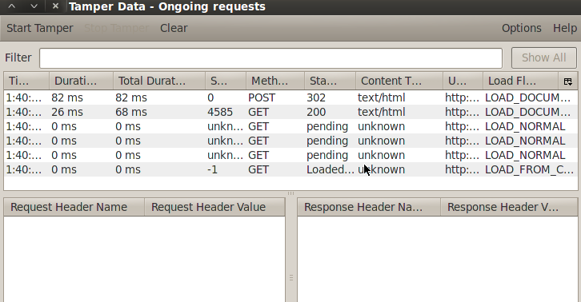
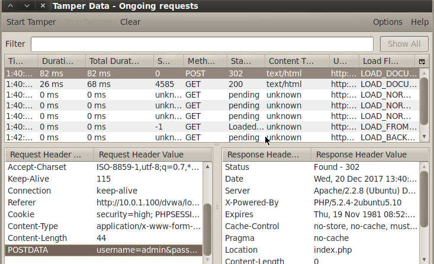
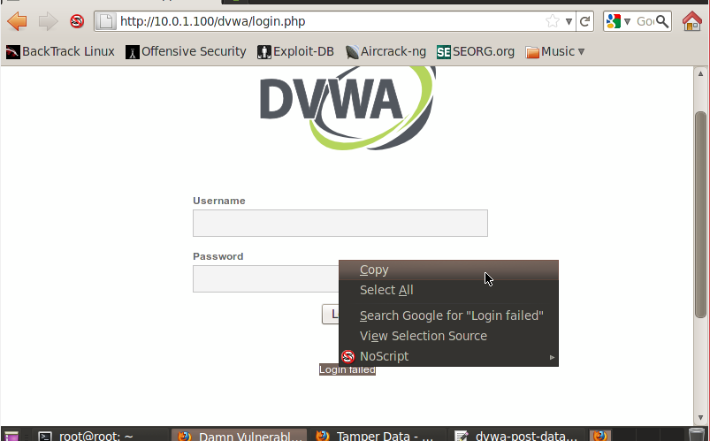
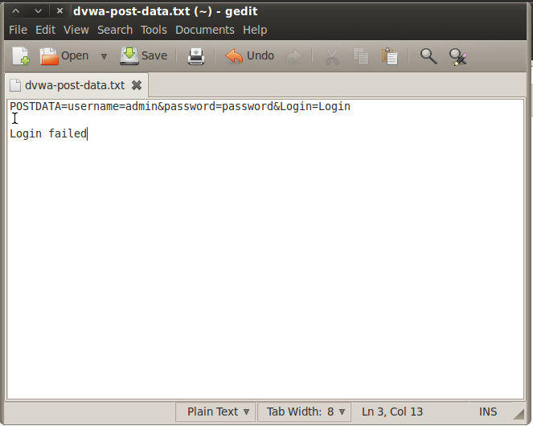
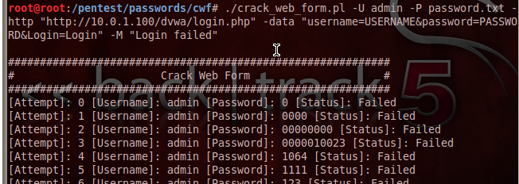
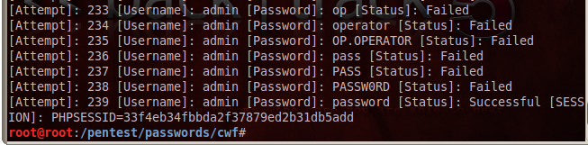

# Lesson 5: Using Tamper Data with crack_web_form.p1

1. Buka browser di backtrack, buka tab tools->add-ons.

2. Secara default di browser backtrack telah terinstall Tamper Data, klik enable lalu restart firefox

3. Akses alamat ip dari server metasploit, kemudian masuk ke halaman login DVWA.

4. Pada tab tools, pilih Tamper Data, maka akan jendela berikut.


5. Masukkan username dan password yang benar ke halaman login DVWA, klik submit.

6. Sebuah pop up akan muncul, hilangkan centang untuk continue tampering dan kemudian submit.


7. Di jendela Tamper Data akan terlihat semua lalu lintas data yang terjadi, baik GET maupun POST.


8. Klik pada baris POST, maka request header dan nilainya akan terlihat. Jika username dan password yang dimasukkan bena kedua nilanya akan ditampilkan disini.


9. Salin nilai tersebut ke gedit. Simpan dengan nama dvwa-post-data.txt

10. Logout dan coba kembali melakukan proses tersebut dengan sebuah password  yang salah.


11. Salin teks yang menyatakan terjadinya kesalahan  password, pindahkan ke file dvwa-post-data.txt.
picture(18)


12. Buat folder /pentest/passwords/cwf.
```
mkdir /pentest/passwords/cwf
```

13. Di browser, akses halaman berikut.
```
http://www.computersecuritystudent.com/SECURITY_TOOLS/DVWA/DVWAv107/lesson5/cwf.tar.gz
```

14. Simpan hasil downloadnya di folder /pentest/passwords/cwf.

15. masuk ke folder cwf dan ekstrak hasil download.
```
tar xovfz cwf.tar.gz
```

16. Ubah hak akses file tersebut.
```
chmod 700 crack_web_form.pl
```

17. Jalankan perintah berikut 
```
./crack_web_form.pl -U admin -P password.txt -http "http://192.168.1.106/dvwa/login.php" -data "username=USERNAME&password=PASSWORD&Login=Login" -M "Login failed"```
picture(21-1 dan 21-2)



